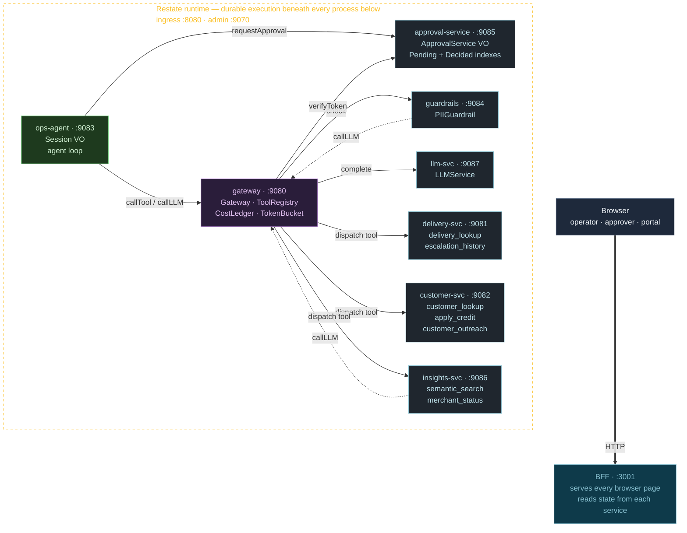

# DashOps on Restate

A small but complete agent platform built on [Restate](https://restate.dev). An **operator agent** investigates and resolves operational issues in a food-delivery-flavored mock world, behind an **agent gateway** that owns policy, cost, rate limits, and approvals. Every call between every process is durable; every piece of state is persisted in a Restate Virtual Object; the entire process tree can be ripped apart and reassembled live without losing in-flight work.

## Running it

From a terminal at the repo root:

```sh
./dashops
```

(equivalent: `npm start` or `npm run dev:supervisor`)

That launches the **supervisor TUI**. The supervisor is the one process you'll start by hand; it spawns every other process as a child — including `restate-server` itself. The TUI shows a live table of every supervised process with its status, PID, uptime, and port. Keys:

| Key | Action |
|---|---|
| `↑` / `↓` | move selection |
| `s` | start the selected process |
| `k` | kill it (SIGTERM) |
| `r` | restart it |
| `l` | toggle the log pane for the selected process |
| `q` | quit (SIGTERMs every child, exits cleanly) |

Once everything is green:

- Operator chat: <http://localhost:3001/operator>
- Approver UI: <http://localhost:3001/approver>
- Services portal (per-service ops views): <http://localhost:3001/services>
- Restate admin (durable journals, deployments): <http://localhost:9070/ui/>

## Architecture



**How to read this:**

- Every box is a separate **OS process**. `lsof -nP -iTCP -sTCP:LISTEN` shows one TCP listener per port.
- Arrows are **logical caller → callee** edges between application services. Every one actually traverses Restate's ingress at runtime — Restate journals the call, deduplicates retries, and resumes durably after process death. The runtime is drawn as the dashed backdrop on purpose: showing it as a hop on every arrow would clutter the picture without adding information. Treat it as the substrate.
- Dotted arrows (`guardrails → gateway`, `insights → gateway`) are cross-cutting LLM calls — the PII guardrail's classifier and the semantic-search tool route their own LLM access back through `Gateway.callLLM` so every LLM call gets the same policy/cost/audit treatment.
- The BFF reads state from every service in the runtime to render its pages, but those edges aren't drawn — they're plumbing, not architecture. The interesting calls are agent → gateway → tools/guardrails/LLM, and those are what the diagram emphasizes.
- A supervisor process spawns and kills every box above (see [Running it](#running-it)), but it's operational tooling rather than part of the architecture itself, so it's not drawn here.

## What each process does

| Process | Role | Notable Restate constructs |
|---|---|---|
| **supervisor** (TUI, terminal) | Master process. Spawns every other process and reaps them on quit. The one thing you'd never deliberately kill. | none — it's outside the runtime |
| **bff** (`:3001`) | Stateless web tier. Serves `/operator`, `/approver`, `/services`, `/ops/<svc>`, and proxies `/api/*` to the Restate ingress. Every browser-facing pixel comes from here. | none — it's a plain HTTP server |
| **gateway** (`:9080`) | The single chokepoint every agent ↔ tool ↔ LLM call passes through. Owns the middleware chain (PII, approval policy, rate limit), the tool registry, the cost ledger, the token buckets, and the in-process recent-calls log. | `restate.service` × 4 (Gateway, ToolRegistry, CostLedger, TokenBucket) |
| **ops-agent** (`:9083`) | Per-session agent loop. A planner picks the next tool/LLM call from the chat history, dispatches through the gateway, and (when policy says so) suspends on an awakeable until an approver decides. | `Session` Virtual Object keyed by `sessionId`; awakeables for HITL |
| **approval-service** (`:9085`) | Async human-in-the-loop. One VO per pending approval holds the action context + the awakeable id; per-group indexes track what's pending and what's been decided (audit trail). | `ApprovalService` VO + `PendingApprovalsIndex` + `DecidedApprovalsIndex` |
| **llm-svc** (`:9087`) | The single backend for every LLM call in the system. Stub mode (default) returns deterministic responses; live mode (with `ANTHROPIC_API_KEY`) calls the Anthropic SDK. Same surface either way. | `restate.service` with `complete`, `purposeCounters`, `mode` handlers |
| **guardrails** (`:9084`) | Outbound safety checks called from gateway middlewares. Today: regex PII pre-screen; live mode would swap in a real classifier. | `PIIGuardrail` service |
| **delivery-svc** (`:9081`) | Read-only delivery-domain tools: `delivery_lookup`, `escalation_history`. | `DeliveryLookup` + `EscalationHistory` services |
| **customer-svc** (`:9082`) | Customer-domain reads + writes: `customer_lookup`, `apply_credit`, `customer_outreach`. `apply_credit` carries a deliberately buggy mode (`BUGGY_MODE=1`) to demo pause-and-resume. | `CustomerLookup`, `ApplyCredit`, `CustomerOutreach` services |
| **insights-svc** (`:9086`) | Analytical tools: `semantic_search` (LLM-backed; 5¢/call) and `merchant_status` (tightly rate-limited at 6/min — drives the queueing demo). | `SemanticSearch`, `MerchantStatus` services |

Each tool service **self-registers** its tools with the gateway's `ToolRegistry` at startup (see `services/shared/src/self-register.ts`). Adding a new tool is one new file plus a line in its `selfRegisterTools(...)` call — no agent or gateway code changes.

## Why the gateway is the centerpiece

Every agent-side call — tool dispatch, LLM completion, anything that reaches outside the agent's own VO — routes through `Gateway.callTool` or `Gateway.callLLM`. That single chokepoint gets you, for free, in one place:

1. **Single audit log.** Every dispatch is recorded into a ring buffer along with status (ok / needs_approval / blocked / blocked·appealable), the originating middleware, the Restate invocation id (deep-linked to the admin UI), the resulting cost, and the trace id that ties the call to its agent turn. The gateway's ops view at `/ops/gateway` renders the last ~30 of these grouped by agent turn.
2. **Single cost ledger.** Every cost-bearing call writes a `CostEntry` keyed by tenant. The same ledger holds tool costs, LLM costs (with a `llm:<purpose>` prefix), and cross-cutting platform costs (PII checks bill the `platform` tenant; the agent's own LLM calls bill the user's tenant). Live-readable at `/ops/gateway`.
3. **Centralized policy.** `services/gateway/src/policies.ts` is the entire approval ruleset. One file decides which calls need a human and which approver group decides.
4. **Token-bound, single-use approval verification.** When an approver decides, the agent retries the call with an approval token. The gateway re-verifies the token against the *exact* `(toolName, params)` fingerprint — operators can't replay an approval against a different action.
5. **Appealable blocks.** PII / safety guardrails return `block_appealable`; the operator can request human review (different approver group). On approval, the gateway verifies an `appealToken` and selectively bypasses just the middleware that blocked. Symmetric mechanism to (4).
6. **Hierarchical rate limiting with durable queueing.** Every call acquires from three token buckets (`global:<tool>`, `tenant:<id>`, `tenant_tool:<id>:<tool>`). When a bucket is empty, the gateway sleeps the call durably via `ctx.sleep` until tokens refill — no client-side retry loop anywhere in the agent. The limits are **editable live from the ops view** (−/+ buttons).
7. **Identity injection.** The agent constructs a `CallerIdentity` once per turn (`tenantId`, `userId`, `agentId`, `sessionId`, `traceId`). The gateway forwards it to tools. Tools don't need to know anything about authentication, multi-tenancy, or tracing.
8. **Trace propagation across the whole turn.** The `traceId` minted in `Session.sendMessage` flows through every downstream gateway call — including the cross-cutting LLM calls the PII guardrail makes. The recent-calls log groups rows by trace id, so one "send" click in the operator UI lights up as one contiguous cluster.
9. **Universal LLM access.** The agent planner, the PII classifier, the semantic-search tool — all three make LLM calls, all three go through `Gateway.callLLM`. Identical audit, cost, rate-limit handling. The `llm-svc` ops view shows per-purpose counters; the cost ledger shows `llm:agent-planning`, `llm:guardrail-pii`, `llm:semantic-search` as distinct line items.
10. **Decoupled tool discovery.** The agent calls `gateway.callTool("apply_credit", {...})`. The gateway looks up the tool in the registry (a VO that tools self-register into at startup) and dispatches. Add a new tool = a new service + one `selfRegisterTools` call; zero changes in the gateway or the agent.

Removing the gateway would mean re-implementing every one of those concerns in every agent, or worse, in every tool. Centralizing them is the whole architectural argument.

## Restate features exercised

| Feature | Where in the demo |
|---|---|
| **Virtual Objects** (keyed state + serialized handlers) | Session, ToolRegistry, CostLedger, TokenBucket, ApprovalService, PendingApprovalsIndex, DecidedApprovalsIndex |
| **Awakeables** | `Session.sendMessage` suspends on an awakeable; `ApprovalService.respond` resolves it. Same pattern for appeals. |
| **Durable sleep** (`ctx.sleep`) | The rate-limit middleware sleeps gateway calls when a bucket is empty — survives process restarts. |
| **Durable side effects** (`ctx.run`) | `apply_credit`, `customer_outreach`, the gateway's recent-calls log write — no double-execution on replay. |
| **Fire-and-forget invocation** (`/send`) | Web bridge → `Session.sendMessage/send` so the HTTP submit returns instantly while the VO runs durably. |
| **Shared (read-only) handlers** | Every BFF state read: registry list, cost summary, bucket state, pending approvals, decided history, tool counters. |
| **Retry policy + `onMaxAttempts: pause`** | `apply_credit` with `BUGGY_MODE=1`: retries 3×, pauses. Restart the service with the fix; resume from journal. |
| **Trace propagation** | `CallerIdentity.traceId` minted per `Session.sendMessage`, threaded through every downstream call. |
| **Deterministic primitives** | `ctx.rand.uuidv4()`, `ctx.date.now()` — message ids and timestamps survive replay. |
| **Durable execution across process death** | The "pull every pin" runbook in [DEMO.md](./DEMO.md). |

## Repo layout

```
.
├── dashops                          # launcher → supervisor TUI
├── services/
│   ├── supervisor/   # TUI + process manager (no port)
│   ├── bff/          # browser-facing HTTP on :3001 (stateless)
│   ├── shared/       # types + helpers shared across the rest
│   ├── gateway/      # Gateway, ToolRegistry, CostLedger, TokenBucket
│   ├── ops-agent/    # Session VO + planner loop
│   ├── approval-service/   # ApprovalService VO + Pending/Decided indexes
│   ├── llm-svc/      # LLMService (stub today, Anthropic in live mode)
│   ├── guardrails/   # PIIGuardrail
│   ├── delivery-svc/ # delivery_lookup, escalation_history
│   ├── customer-svc/ # customer_lookup, apply_credit, customer_outreach
│   └── insights-svc/ # semantic_search, merchant_status
└── web/
    ├── operator/     # static chat UI
    └── approver/     # static approver UI
```

## Files worth reading first

For a code review:

- `services/gateway/src/gateway.ts` — the single dispatcher every call flows through. ~250 lines.
- `services/gateway/src/middlewares/{rate-limit,approval-policy,pii-guardrail}.ts` — the chain.
- `services/ops-agent/src/session.ts` — Session VO with the awakeable suspension pattern.
- `services/llm-svc/src/llm.ts` — single LLM surface; routes stub vs live.
- `services/bff/src/index.ts` — every browser-facing route in one file; renders all pages.
- `services/supervisor/src/{procs,tui,index}.ts` — process supervisor + TUI.

## Stub vs live LLM mode

LLM calls today use deterministic stubs (`services/llm-svc/src/stubs.ts`) so the demo is reproducible. Setting `ANTHROPIC_API_KEY` switches `llm-svc` into live mode, swapping in real Anthropic SDK calls — the surface (`Gateway.callLLM`) doesn't change either way. That's the point of routing every LLM call through the gateway: stub and live mode are interchangeable from every caller's perspective.

## What to read next

[**DEMO.md**](./DEMO.md) — the narrative walkthrough for tomorrow's review. Story-level: what to type, what to watch for, what each scene proves.
